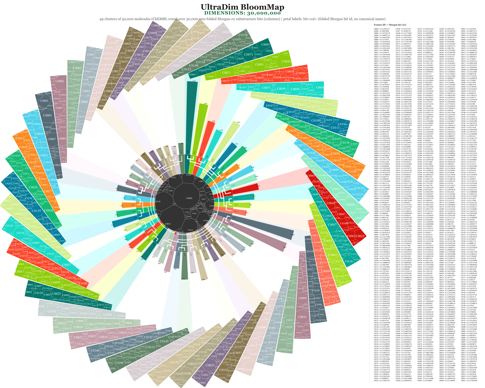
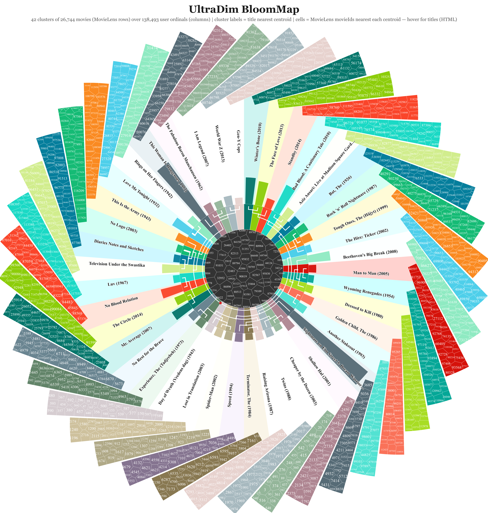
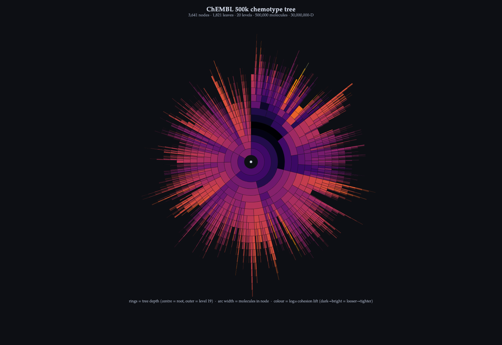
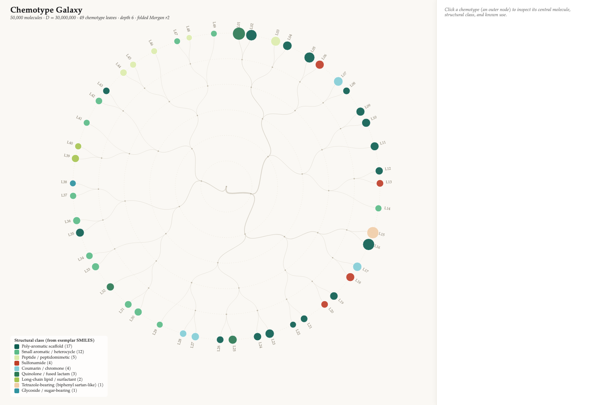

# BloomMap

BloomMap draws a hierarchical clustering as a circular phylogram: a centre, a
ring of population-sized leaves, and petals that carry each leaf's
distinguishing features. It reads UltraDim's hierarchical clustering and renders
it: UltraDim's output is BloomMap's input.

<p align="center">
  
  
</p>
<p align="center"><i>Two BloomMaps. Left: 49 clusters of 50,000 ChEMBL molecules over 30,000,000 folded Morgan-bit columns; petal labels are the folded Morgan bit ids. Right: 42 clusters of 26,744 MovieLens films over 138,493 user columns; the petal labels are film titles, and the numbers inside the cells are MovieLens movieIds — the interactive version (<a href="posters/ml20m_movies_bloommap.html">ml20m_movies_bloommap.html</a>) resolves them to titles on hover.</i></p>

### Other visualisations of the same clusterings

The same hierarchical clustering can be drawn other ways. These are not BloomMaps:

<p align="center">
  
  
</p>
<p align="center"><i>Left: a radial <b>sunburst</b> of the ChEMBL 500,000-molecule tree (3,641 nodes, 1,821 leaves, 20 levels), coloured by cohesion lift — open <a href="galaxy/sunburst.html">galaxy/sunburst.html</a>. Right: the <b>Chemotype Galaxy</b>, 49 chemotype leaves of 50,000 molecules coloured by structural class, where clicking a leaf inspects its central molecule — open <a href="galaxy/dist/chemotype-galaxy/index.html">galaxy/dist/chemotype-galaxy/index.html</a>.</i></p>

## The pipeline

```
UltraDim                          BloomMap
--------                          --------
HierarchicalClusterUltradimV23  →  a tree (nodes.jsonl) + a row→leaf map (csv)
                                   + the sparse corpus (.npz)
        process/*.py             →  bloommap.{tree,volumes,themes,meta}.json
        renderer/  (D3)          →  an SVG/PNG poster, or an interactive page
```

1. **Cluster in UltraDim.** `process/hseg_chembl.py` and `process/hseg_ml20m_movies.py` run `HierarchicalClusterUltradimV23` against a corpus and write the tree (`data/source/*_hseg.nodes.jsonl`) and the row→leaf map.
2. **Build the BloomMap JSON.** `process/build_bloommap_json_chembl.py` and `..._ml20m.py` read the tree and the sparse corpus and emit the four JSON files the renderer consumes. Both import the shared helpers in `process/bloommap_build.py`.
3. **Render.** The D3 code in `renderer/` draws the JSON. `renderer/render.mjs` rasterises a page to SVG/PNG with headless Chrome; the page itself can also be opened in a browser.

## What opens where

GitHub shows the static SVG and PNG posters inline. It does not run the
JavaScript in an HTML file, so the interactive pages must be opened locally.

**Open by double-clicking (offline, no server — the data is inlined):**

| File | What it is |
|---|---|
| `galaxy/sunburst.html` | the ChEMBL 500k chemotype tree as a radial sunburst (fully self-contained; D3 is inlined) |
| `galaxy/dist/chemotype-galaxy/index.html` | the Chemotype Galaxy — click a leaf to inspect its central molecule, structural class and known use (loads its D3 and drawing libraries from the `lib/` folder beside it, so keep that folder) |
| `posters/ml20m_movies_bloommap.html` | the MovieLens BloomMap — hover a leaf for its films, with clickable IMDb links (self-contained) |

**Need a local server** (they load their data from sibling JSON files, which a
browser blocks over `file://`):

```bash
cd renderer && python3 -m http.server 8000
# then open http://localhost:8000/chembl50k30m.html or ml20m.html
```

**Static posters (render on GitHub, print at poster size):**
`posters/chembl_50k_30M_bloommap.svg` / `.png`, `posters/chembl_500k_sunburst.svg`,
`posters/ml20m_movies_bloommap.svg` / `.png`.

## From your own clustering

Cluster your corpus in UltraDim, then adapt one of the `process/build_bloommap_json_*.py`
producers — supply your tree, your sparse corpus, and a dictionary that maps a
column index to a label. The producer writes the four JSON files; point a copy
of `renderer/chembl50k30m.html` at them, or feed them to `render.mjs`.

## Requirements

- The producers are Python and use `numpy` and `scipy.sparse`.
- `renderer/render.mjs` needs Node 18+ and a headless-capable Chrome or
  Chromium (set `CHROME_PATH` if it is not on the default path), and
  `rsvg-convert` for the PDF step. The interactive pages need only a browser.

## Licence

BloomMap is MIT, © Kaito. The D3 and voronoi libraries vendored under
`renderer/lib/` and `galaxy/*/lib/` carry their own MIT/BSD licences.
