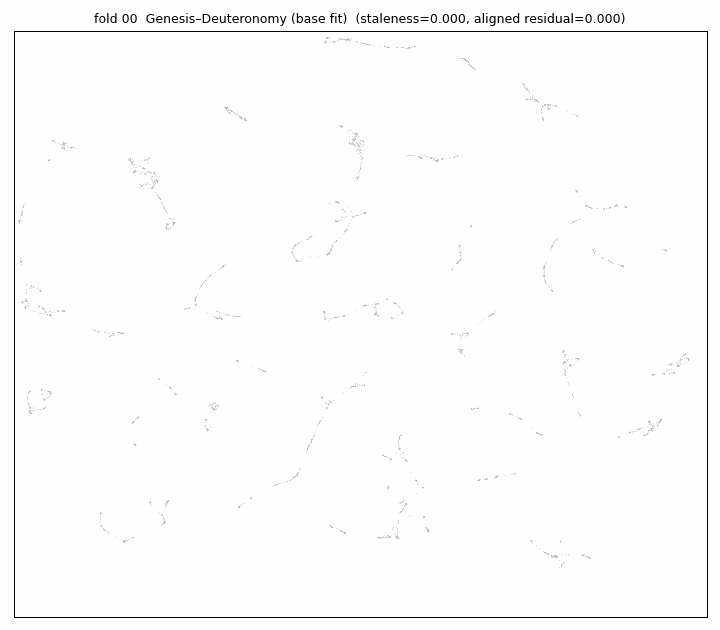
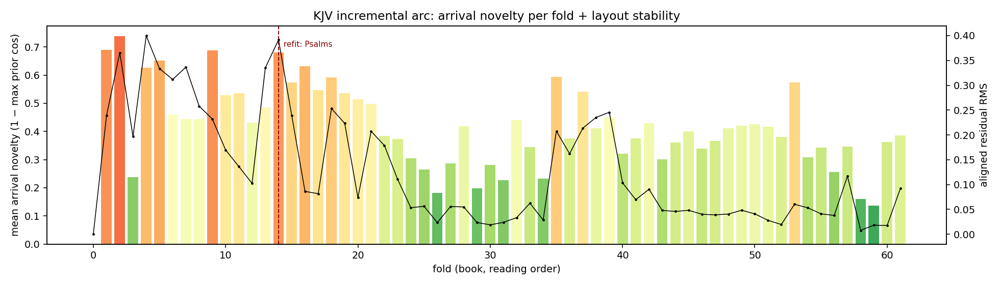

# Tuning UltraDim

Wheel 0.4.0, September 2026.

This guide describes the settings that determine the retrieval quality of
an UltraDim index, the procedure for measuring that quality, and the order
in which to change the settings when a family falls below the recall
tolerance.

## 1. Automatic tuning

The wheel includes a tuner, `ultradim.autotune`. Given a sample of sparse
rows, a few thousand, and a minimum recall, it derives the non-zero cap from
the sample, builds one family, measures recall against exact ground truth
at four and then eight seeds, and widens the target width only if the
seeds do not suffice. It stops at the first configuration that meets the
requirement.

```python
from ultradim.autotune import SparseRow, autotune

sample = [SparseRow(indices=[...], values=[...]), ...]
result = autotune(db, sample, min_recall=0.99, k=10, n_queries=200)
print(result.best, result.best_recall, result.verdict)
```

`result.sweep` lists every configuration tried with its measured recall.
If no configuration meets the requirement, `result.verdict` states this,
and the sweep is the evidence.

Sections 2 to 7 describe the same procedure step by step, for readers who
wish to understand the tuner's decisions or to carry out one step by hand.

## 2. Principle

UltraDim reduces each row to a target width, `projection_dim`, before
indexing it. The reduction is governed by two settings: the seeds, of which
there may be one or more, and the target width. Increasing either raises
recall.

When a search fails to return a row's true neighbours, the usual cause is
that the reduction has removed the distinction between them. The neighbours
exist in the data. The remedy is therefore more seeds or a wider target
width, and not a more exhaustive search.

## 3. Settings

Settings are of two kinds. Creation settings are fixed when a family is
created; changing one requires a new family. Query settings are supplied
with each request and may be varied without cost.

### 3.1 Creation settings

| Setting | Meaning | Standard value | Effect on recall |
|---|---|---|---|
| `source_dim` | The width of the raw input. | Determined by the data. | None; not a choice. |
| `projection_dim` | The target width of the reduction. | 2048 | Widening to 4096 raises recall. Requires a new family. |
| `seeds` | The seeds used by the reduction. | Four. Datasets of thirty million dimensions were indexed with four. | Eight seeds for the uncommon corpus that four cannot separate. Requires a new family. |
| `max_nnz_per_row` | The greatest number of non-zeros a sparse row may carry. A row above the cap is rejected, not truncated. | Derived from the data; see §6. | A cap set too low discards real rows. |
| `sparse_substrate` | Sparse or dense storage. | Determined by the data. | None; a storage choice. |

The creation request accepts further fields. They are reserved and have no
effect in 0.4.0.

### 3.2 Query settings

| Setting | Meaning | Effect on recall |
|---|---|---|
| `active_seeds` | The subset of the family's seeds used for the query. A family built with eight seeds may be queried with four or with eight, without rebuilding. | More seeds, higher recall. |
| `k` | The k in recall@k. | None; a reporting choice. |
| `exclude_self` | Whether the query row is excluded from its own results. | See below. |

`exclude_self` must be set to true whenever the query rows are themselves
in the index. The query row matches itself at rank one; if it is not
excluded, recall@10 is exactly 0.9 for every configuration, because the
query occupies one of the ten returned positions while the exact answer
omits it. A recall of exactly 0.9000 across all configurations indicates
this setting, not a property of the data.

`MeasureRecall` accepts further fields. They are reserved and have no
effect in 0.4.0.

## 4. Incremental UMAP: handling out-of-tolerance events

UltraDim's implementation of UMAP is unique in its ability to be constructed
incrementally and updated over time. It does this by editing its internal
nearest neighbour graph to accommodate newly ingested data. This update
process provides UltraDim users with a unique advantage: when a new dataset
arrives there is a moment prior to rebuilding the graph when we are able to
score how well the new data fits the old model. This distance from the old
model amounts to an anomaly detection measurement. It can also measure data
drift more generally. When data is streaming into the system, updating the
knn model record by record is too slow, so we monitor for drift, and when we
have an out of tolerance event, we trigger a rebuild which we need to do
carefully, so that the new model is aligned as far as possible to the old
model. The procedure is:

### 4.1 Score the arrivals

Score each arrival before it is placed. Its novelty is one minus its greatest
cosine to any row already in the map, from `TransformUltradimV23Umap` with
diagnostics, or exactly by brute force. The mean novelty of a batch is the
drift reading for that batch.

### 4.2 Fold the batch in

Fold the batch in with `IncrementalFitUltradimV23Umap`. Rows already placed
keep their positions; only the arrivals and their immediate neighbours move.
The response gives `staleness_fraction`, the folded-in rows as a share of the
fitted corpus, and sets `refit_recommended` once that share passes one fifth.
The residual between the new map and the previous one, after aligning them
on shared rows, is the stability reading; the engine reports it per fold.

### 4.3 Rebuild when out of tolerance

When staleness, novelty or the residual crosses the tolerance you have set,
refit: `FitUltradimV23Umap` on the grown graph with the same seed and
neighbour count, then align the new map to the old by a rigid transform
fitted on the rows they share, so that the frame of reference carries over.
The old map is retained under its own id; the two together are the record of
what changed.

### 4.4 Example: the King James Bible, book by book





The King James Bible ingested book by book, 24,995 verses. Grey: verses
already on the map. Coloured: the arriving book, green for expected, red for
novel. The strip below gives mean arrival novelty per book and the aligned
residual, with the point at which a refit was recommended.

## 5. Measurement

The engine measures its own recall exactly; no external tool is required.

1. `CreateSparseOracles` takes a held-out set of query rows, a few hundred,
   computes their exact top-k neighbours by exhaustive comparison, writes
   the result to a file, and returns its path. Despite its name it accepts
   dense families. One oracle is built per family.
2. `MeasureRecall` takes the oracle path, `k`, `exclude_self=true`, and an
   `active_seeds` subset, and returns `recall_at_k`, the mean over the
   queries, with latency percentiles. Latency is reported beside recall.
3. A change to `seeds` or `projection_dim` requires a new family and a new
   oracle. This is the slow axis of the search and is varied last.

## 6. The non-zero cap

`max_nnz_per_row` bounds the number of non-zeros in a sparse row. A row
above the cap is rejected. There is no correct fixed value; the cap is
derived from the data. The dataset is scanned before the family is
created, the greatest non-zero count observed is taken, and the cap is set
to `ceil(1.10 × observed_max)`. The margin of ten per cent admits a denser
row arriving later. The cap cannot be changed after rows have been
inserted without rebuilding the family.

## 7. Worked example

A family of sparse rows was built with `projection_dim=2048`, four seeds
and `max_nnz_per_row=2048`. Its measured recall@10 was 0.92, below the
tolerance of 0.99.

1. The family was rebuilt with eight seeds and measured at four and at
   eight `active_seeds` against one oracle. Recall rose from 0.92 to 0.95.
   The tolerance was not met, but recall moved, so the seeds were not
   the limit.
2. The family was rebuilt with eight seeds and `projection_dim=4096`, with
   the cap re-derived from the data, and measured again against a new
   oracle. Recall at eight seeds exceeded 0.99.
3. The map was fitted on that family.

The tuner performs these steps in this order.

## 8. Summary

| Situation | Action |
|---|---|
| Recall below tolerance | Seeds first: four, then eight (§4.1). Then the target width, 2048 to 4096 (§4.2). Only then the data (§4.3). |
| Varied per request | `active_seeds`, `k`. `exclude_self=true` for any self-query test. |
| Requires a new family | `seeds`, `projection_dim`, `max_nnz_per_row`. |
| Measurement | `CreateSparseOracles` once per family; `MeasureRecall` per configuration. |
| Non-zero cap | `ceil(1.10 × observed_max_nnz)` from a scan of the data. |
| Automatic | `ultradim.autotune` (§1). |
