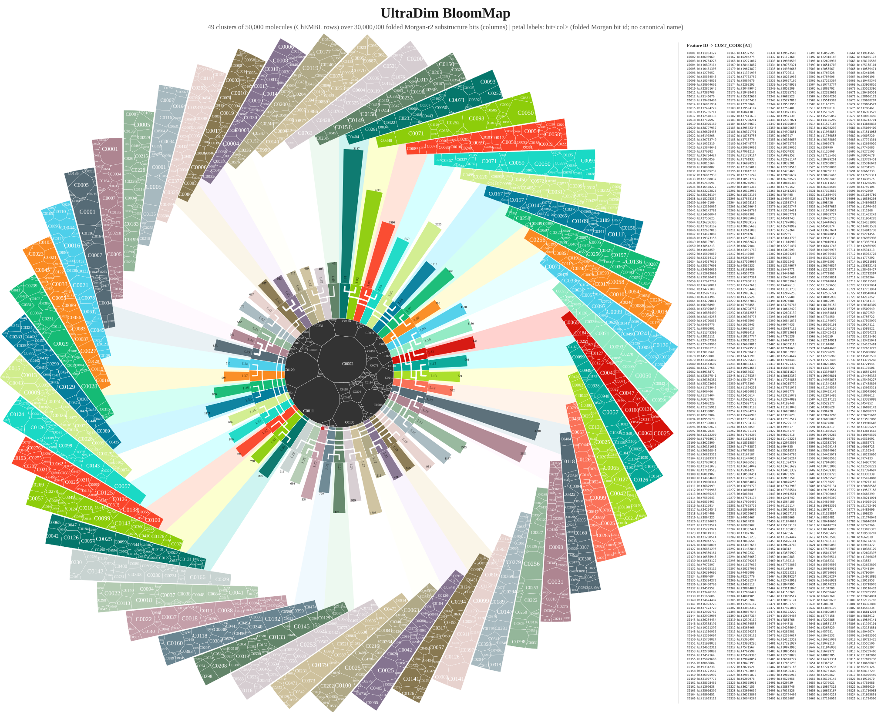
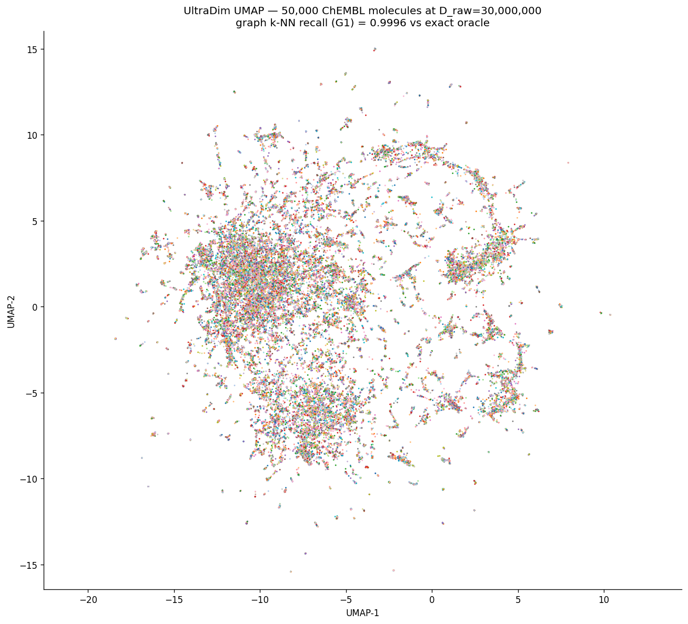
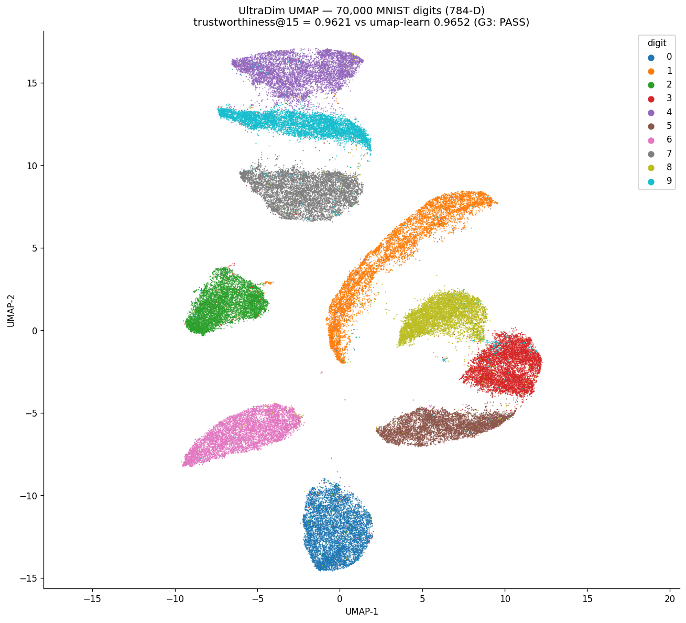
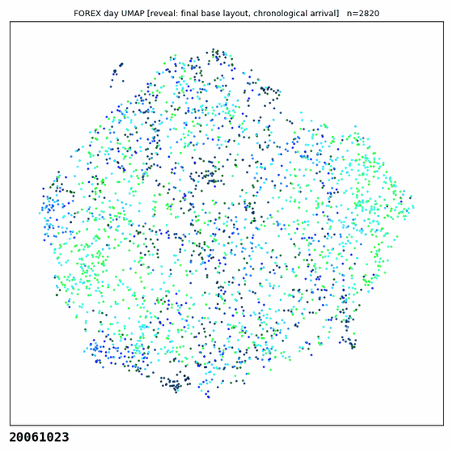
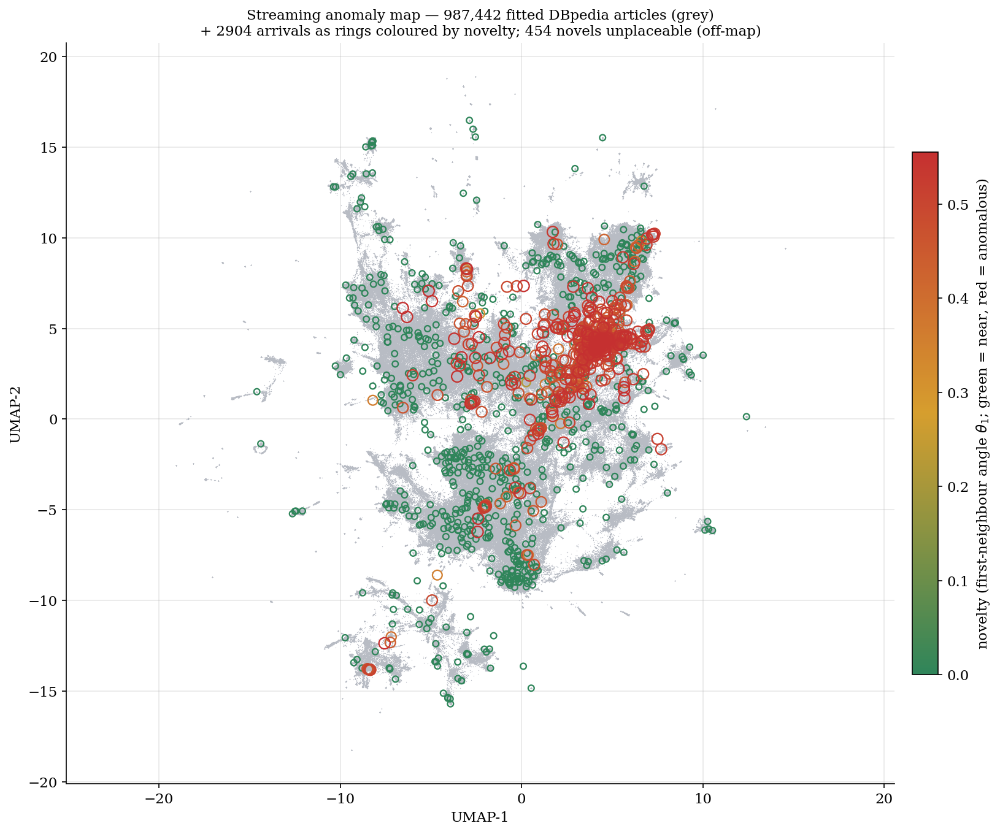
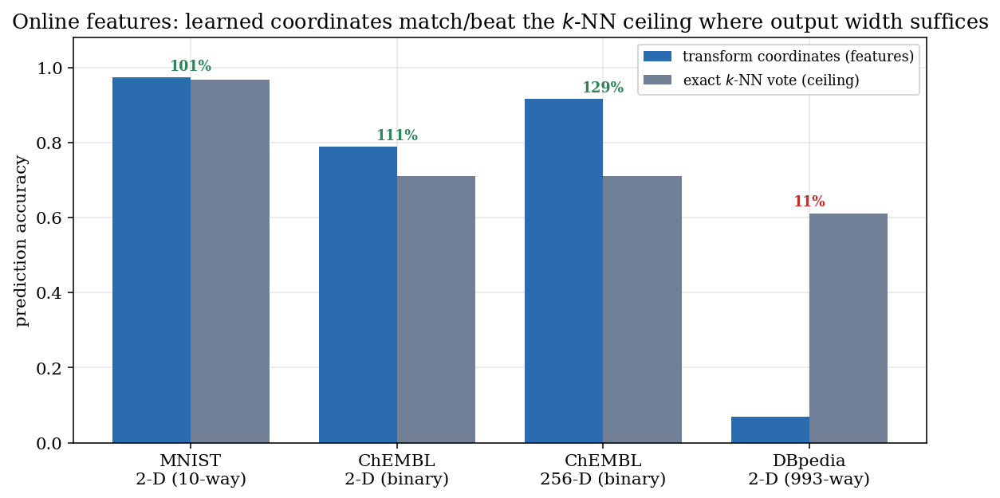
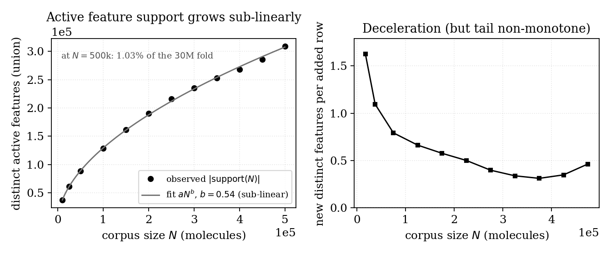

# UltraDim

**Una base de datos vectorial analítica rápida, concebida para conjuntos de datos de dimensionalidad extrema.**<br>
**Probada a 30 millones de dimensiones, con el objetivo de llegar a mil millones.**

*Este documento es la traducción al español del [README en inglés](../README.md). Las rutas y los enlaces apuntan a los archivos del repositorio.*

*¿Es nuevo en esto? [Para los no técnicos: ¿qué son los datos dispersos de alta dimensionalidad?](es_WHAT_IS_HIGH_DIMENSIONAL_SPARSE_DATA.md)*

UltraDim almacena, busca, cartografía, clasifica y agrupa vectores mucho más allá de los límites dimensionales de las bases de datos vectoriales convencionales: datos densos hasta ~256 000 dimensiones, datos dispersos hasta decenas de millones, probado en ejecuciones de producción a **30 000 000 de dimensiones** sobre corpus reales de química, con demostraciones a 100 millones de dimensiones. Está escrita en Rust, acelerada por GPU mediante Metal en macOS y Vulkan en Linux, y se maneja desde Python.

UltraDim se distribuye como un paquete Python compilado (wheel) para macOS en Apple Silicon, Linux x86_64 y Linux arm64, para Python 3.12. La versión actual es la 0.4.0, en la página de [Releases](../../../releases). El uso no comercial es gratuito bajo la licencia PolyForm Noncommercial 1.0.0. El uso comercial requiere una licencia de Gamakon Ltd. El texto de la licencia es [`LICENSE`](../LICENSE); el aviso que explica ambas modalidades es [`LICENSES/LICENSE.md`](../LICENSES/LICENSE.md).

<p align="center">
  
</p>
<p align="center"><i>El espacio químico como BloomMap: 50 000 moléculas de ChEMBL, agrupadas jerárquicamente a su anchura nativa de 30 000 000 de dimensiones.</i></p>

---

## Funciones

- **Carga de datos ultradimensionales** — ingiera vectores densos grandes, probados hasta ~256 000 dimensiones; o vectores dispersos grandes, probados hasta 30 M, con 100 M demostrados. Sus necesidades de RAM y de disco crecen con sus valores no nulos, no con el tamaño bruto del vector.
- **Búsqueda autoverificada** — puntuaciones de coseno exactas, con certificados de exhaustividad (recall) medidos bajo demanda contra una búsqueda exhaustiva exacta
- **Búsqueda densa de alto rendimiento** — 1 339 consultas/s a 2,99 ms en el p50 sobre DBpedia-1M, precisión@10 = 0,9945
- **Mapas UMAP nativos** — implementación de UMAP determinista, en caché y rápida para conjuntos de datos ultradimensionales. Los nuevos puntos no vistos se puntúan en milisegundos; incluye reajuste incremental a ~1,5 % del coste de una reconstrucción; salidas entre 2-D y 256-D, que sirven tanto para la visualización como para la reducción de dimensionalidad.
- **Construcción de grafos k-NN con umbrales de calidad** — cada grafo lleva una medida de exhaustividad; los mapas se niegan a ajustarse sobre grafos por debajo de 0,99
- **Agrupamiento para datos ultradimensionales, incluso con 30 millones de dimensiones** — k-means esférico y agrupamiento jerárquico rápidos, residentes en GPU, que ofrecen agrupamiento sobre datos brutos de dimensionalidad extrema.
- **Detección de anomalías en alta dimensión, en flujo** — evaluar las llegadas contra la estructura de vecinos más próximos existente en alta dimensión, y colocarlas después sobre un mapa UMAP vivo para que las poblaciones anómalas y emergentes se hagan visibles; la figura en flujo de más abajo es un breve script sobre la RPC de transformación de mapa
- **Factorización y recomendación** — decodificar valores retenidos directamente desde el índice; un método de vecindad sin parámetros, competitivo con referencias entrenadas en un banco de pruebas público
- **Generación de datos sintéticos sobre hiperesferas** — el código ofrece la generación con wgpu de puntos uniformes de Muller-Marsaglia sobre la superficie de la hiperesfera en la que reside nuestro índice de datos. Forma parte de un método experimental para reequilibrar conjuntos de datos aplicando la etiqueta minoritaria de un punto real a sus k vecinos sintéticos más cercanos.
- **Visualización BloomMap** — renderizado de pósteres con calidad de publicación para agrupamientos jerárquicos
- **Operaciones sobre datos** — exportación a CSV, JSON y un formato binario; analítica de colecciones; generación de embeddings de texto en el servidor
- **Tres formas de ejecución** — en su propio proceso como paquete Python; como servidor MCP para un asistente; o como servidor compartido al que muchos clientes acceden por gRPC a través de un puerto, disponible bajo petición. Las mismas 204 RPC en los tres casos.
- **Trazabilidad de principio a fin** — parámetros versionados, semillas, contabilidad de filas y resultados exportables, de modo que toda salida analítica pueda examinarse y repetirse

## Obtenerla

```bash
python3.12 -m venv .venv && source .venv/bin/activate
pip install ./UltraDim-0.4.0-cp312-cp312-macosx_11_0_arm64.whl      # numpy se instala con él
```

```python
import ultradim
db = ultradim.UltraDim("./db")
print(len(db.capabilities()))          # 204
db.call_json("RpcName", '{...}')       # cualquiera de ellas
```

La base de datos se ejecuta dentro de su proceso. No hay ningún servidor que arrancar ni puerto que abrir. Se usa una GPU cuando la hay (Metal en macOS, Vulkan en Linux). Sin GPU, UltraDim carga, indexa y busca datos dispersos y densos, construye grafos de vecindad y linajes de densidad, y mide la exhaustividad. Los ajustes UMAP, el agrupamiento k-means y los linajes k-means necesitan una GPU y devuelven un error sin ella. Medido en [`docs/GPU_SETTINGS.md`](../docs/GPU_SETTINGS.md).

Un servidor MCP, `mcp/ultradim_mcp_server_v0_4_0.py`, envuelve el mismo paquete en forma de 46 herramientas, de modo que un asistente puede crear colecciones, ingerir, indexar, buscar, agrupar y cartografiar sin que usted escriba Python. Su guía es [`mcp/README.md`](../mcp/README.md).

Existe una versión cliente-servidor. Un servidor UltraDim se ejecuta en una máquina anfitriona y lo comparten muchos clientes a través de un puerto. Los clientes escriben y consultan por gRPC. gRPC es un protocolo binario compacto, por lo que la ingesta de vectores anchos es rápida en la red. Es el mismo motor que el paquete, con las mismas 204 RPC. Póngase en contacto con nosotros para obtenerla. Esto incluye a las organizaciones no comerciales que la necesiten: podemos ayudarle a instalarla y configurarla. jesung@gamakon.ai o andrew@gamakon.ai.

## Ejecutarla con un asistente de IA

El repositorio incluye un servidor MCP, `mcp/ultradim_mcp_server_v0_4_0.py`, que expone la base de datos como 46 herramientas a Claude Code, Codex o cualquier asistente que hable MCP. El asistente hace funcionar entonces la base de datos en su nombre: crea la familia, ingiere sus vectores, construye el índice, busca, agrupa y cartografía, y le lee los resultados. Usted describe el estudio; él hace las llamadas.

Instale el paquete, clone este repositorio y abra una sesión de asistente en el clon. Para Claude Code, el archivo `.mcp.json` de la raíz registra el servidor; para Codex, añada a `~/.codex/config.toml`:

```toml
[mcp_servers.ultradim]
command = "python3.12"
args = ["/ruta/a/UltraDim/mcp/ultradim_mcp_server_v0_4_0.py", "--db", "/ruta/a/su/base"]
```

`command` debe ser el Python en el que está instalado el paquete. Después pida, con palabras: «carga los vectores de este archivo en UltraDim, hazlos consultables y muéstrame un mapa». La primera llamada del asistente debe ser la herramienta `whats_available`, que enumera cada herramienta y el camino nominal directamente desde el paquete. La guía completa es [`mcp/README.md`](../mcp/README.md) (en inglés).

## Qué puede hacer con ella

**Buscar en datos ultraanchos y fiarse de las respuestas.** UltraDim trata sus datos a su dimensionalidad nativa — huellas moleculares, cestas de la compra, genómica en codificación one-hot, embeddings de texto — sin hashing de características ni truncamiento por su parte. Las puntuaciones que recibe son cosenos verdaderos contra sus vectores originales, y el índice mide bajo demanda su propia exhaustividad de candidatos contra las respuestas exhaustivas exactas, de modo que cada corpus viene con un certificado de calidad y no con una esperanza.

**Construir mapas 2-D vivos de datos de 30 M de dimensiones.** Los mapas UMAP se calculan de forma nativa en el servidor, por lo que la construcción de mapas funciona con vectores grandes de longitud extrema, donde otras herramientas tienen dificultades incluso para cargar los datos. Los mapas son objetos vivos: los nuevos puntos se colocan sobre un mapa existente en milisegundos, los lotes pequeños se incorporan a aproximadamente el 1,5 % del coste de una reconstrucción, y el historial de versiones del mapa sirve además como detector de deriva para su flujo de datos.

<p align="center">
  
  
</p>
<p align="center"><i>Izquierda: 50 000 moléculas de ChEMBL cartografiadas a 30 000 000 de dimensiones brutas; el grafo de vecindad bajo el mapa midió una exhaustividad de 0,9996 contra el oráculo exacto. Derecha: el mapa de control MNIST 70K, salido de la misma cadena de proceso.</i></p>

<p align="center">
  
</p>
<p align="center"><i>Treinta años del mercado de divisas en un solo mapa. Cada punto es un día de cotización, descrito por los rendimientos estandarizados de 1 992 pares de divisas ese día, y los días que se movieron de forma parecida quedan juntos. El mapa se ajustó sobre los primeros 3 000 días y cada día posterior se incorporó a él a su llegada, cada sesión de enero de 1996 a abril de 2026, coloreada por año. Lo que el mapa muestra es que la dinámica del mercado cambia de un año a otro, y a menudo de forma brusca. Una estrategia de negociación construida sobre los días de un año tiene poco alcance más allá de él antes de perder valor. Los primeros diez años construyeron el mapa base, de modo que la animación muestra de 2007 a 2026; la <a href="../figures/forex_market_full_1996_2026.mp4">serie completa desde 1996</a> es un vídeo de ocho minutos. Aprenda a elaborar uno de estos diagramas a partir de nuestro ejemplo, <a href="../examples/04_living_map_animation.py">examples/04_living_map_animation.py</a>.</i></p>

**Agrupar y puntuar vectores de cualquier longitud.** El k-means esférico y el agrupamiento jerárquico se ejecutan residentes en GPU a dimensionalidad extrema, con puntuaciones de calidad corregidas por dimensión que siguen siendo comparables entre dimensionalidades; así, la pregunta «¿es real este agrupamiento?» tiene una respuesta estadística a 30 M de dimensiones, y no solo a 300.

Puntuación de novedad de las llegadas sobre un mapa ajustado; factorización que decodifica valores retenidos directamente desde el índice; generación de datos sintéticos y aumento de clases minoritarias; analítica de colecciones; exportaciones para las herramientas posteriores.

<p align="center">
  
</p>
<p align="center"><i>Detección de novedad en flujo, mostrada sobre un mapa vivo: 987 442 artículos de DBpedia ajustados (en gris) y 2 904 puntos recién llegados, rodeados y coloreados según su novedad medida; llegadas familiares en verde, anomalías en rojo.</i></p>

<p align="center">
  
  
</p>
<p align="center"><i>Izquierda: la puntuación de novedad separa con nitidez las llegadas familiares de las nuevas. Derecha: analítica de corpus a 30 M de dimensiones; la saturación del soporte de características a medida que crece el corpus de ChEMBL.</i></p>

## Rendimiento medido

Todas las cifras proceden de experimentos controlados contra oráculos exhaustivos exactos, en un único Apple M3 Max; calidad y latencia se informan juntas.

| Corpus | Dimensionalidad | Filas | Calidad | Latencia / caudal |
|---|---|---|---|---|
| Moléculas de ChEMBL (disperso) | 30 000 000 | 500 000 | recall@10 = 0,9992 | 56 ms por consulta |
| Moléculas de ChEMBL (disperso, perfil rápido) | 30 000 000 | 500 000 | recall@10 = 0,9964 | 29 ms por consulta |
| Embeddings de DBpedia (denso) | 1 536 | 1 000 000 | precisión@10 = 0,9945 | 1 339 consultas/s a 2,99 ms en el p50 |
| Cestas de la compra (disperso) | 100 000 | 100 000 | recall@10 = 0,9851 | p50 17,5 ms |
| Datos estructurados sintéticos (disperso) | 1 800 000 | 50 000 | recall@10 = 1,000 | p50 15,7 ms |

Trabajar en altas dimensiones es eficiente gracias a nuestra ingeniería avanzada. Llevar un corpus de 1 M a 10 M de dimensiones añade ~0,08 GiB de memoria residente, porque el almacenamiento disperso crece con sus valores no nulos, no con la dimensionalidad declarada.

## Trabajar con grupos de investigación

UltraDim es utilizado por grupos de investigación en cargas de trabajo científicas reales: representaciones moleculares, perfiles genómicos y epigenómicos, y grandes matrices de observación. El uso en investigación es gratuito bajo la licencia no comercial; descargue el paquete y empiece. Un buen proyecto tiene un corpus de alta dimensionalidad, grande, disperso o lento de analizar con las herramientas actuales; una representación vectorial y una métrica defendibles; y una pregunta de recuperación, de cohorte, de agrupamiento o de visualización.

**[Trabajar con grupos de investigación →](../RESEARCH_GROUPS.md)** — o escriba a **andrew@gamakon.ai** para recibir ayuda con su corpus, o sobre el uso comercial.

## Documentos

| Documento | Contenido |
|---|---|
| [Presentación de UltraDim](../docs/UltraDim_Overview.pdf) | *Analytical Vector Stores for Scientific Research*: motivación, preguntas de investigación, principios de evaluación (no confidencial, junio de 2026, en inglés) |
| [Testimonios](../TESTIMONIALS.md) | Lo que dicen los grupos participantes |
| [Guía del usuario](../docs/UltraDim_User_Guide.md) | Instalación, inicio rápido denso, ejemplo disperso de principio a fin, exhaustividad, mapas, agrupamiento, lista de RPC, autoajuste (en inglés) |
| [Guía de ajuste](../docs/UltraDim_Tuning_Guide.md) | Qué mueve la exhaustividad, qué no, y qué hacer cuando cae por debajo de la tolerancia (en inglés) |
| [Reemplazar y eliminar filas](../docs/SPARSE_UPSERT_SEMANTICS.md) | Identificadores de fila, facetas, reintentos, durabilidad (en inglés) |
| [Con y sin GPU](../docs/GPU_SETTINGS.md) | Qué necesita una GPU, medido; los dos ajustes (en inglés) |
| [Guía del servidor MCP](../mcp/README.md) | Instalación, actualización, cada herramienta, el camino nominal, notas de versión (en inglés) |
| [Registro de cambios](../CHANGELOG.md) | Cada versión, de la 0.1 a la 0.4.0 (en inglés) |

## Acerca de

UltraDim está desarrollada y licenciada por **Gamakon Ltd**. El uso no comercial es gratuito bajo la licencia PolyForm Noncommercial 1.0.0. Existe una versión cliente-servidor disponible bajo petición, también para las organizaciones no comerciales que la necesiten; podemos ayudarle a instalarla y configurarla. Escriba a [jesung@gamakon.ai](mailto:jesung@gamakon.ai) o a [andrew@gamakon.ai](mailto:andrew@gamakon.ai).

### Origen

*Cómo surgió*

Internamente, la base de datos UltraDim utiliza una forma completamente nueva de índice vectorial, desarrollada por Andrew Morgan, autor de *Mastering Spark for Data Science*. Inventó este índice para construir y poner a prueba sus ideas para resolver el reto ARC-AGI; ese trabajo sigue en marcha.

Con treinta años de ingeniería en ciencia de datos a sus espaldas, Andrew lo implementó con una larga lista de optimizaciones que, junto con el nuevo índice, permiten sustituir un gran clúster de Spark por un portátil Mac.

Andrew se apoyó en la IA, pero explica que fue extremadamente frustrante. «A la IA no le gusta innovar. Como nunca había visto este diseño de índice, le costaba una y otra vez aportar algo útil, y a menudo devolvía deliberadamente el código a ideas antiguas.» Tras un año de frustración persistente, el resultado es un sistema del que estamos genuinamente orgullosos. Esperamos que lo disfrute y que lo use para construir algo extraordinario.
